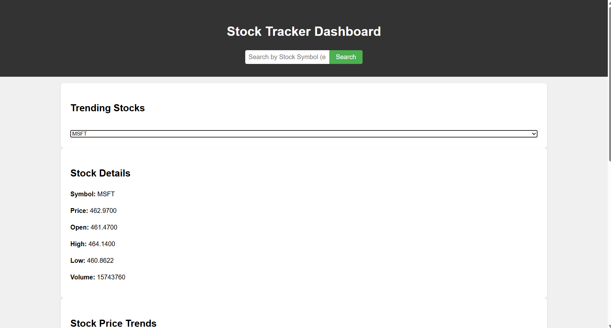
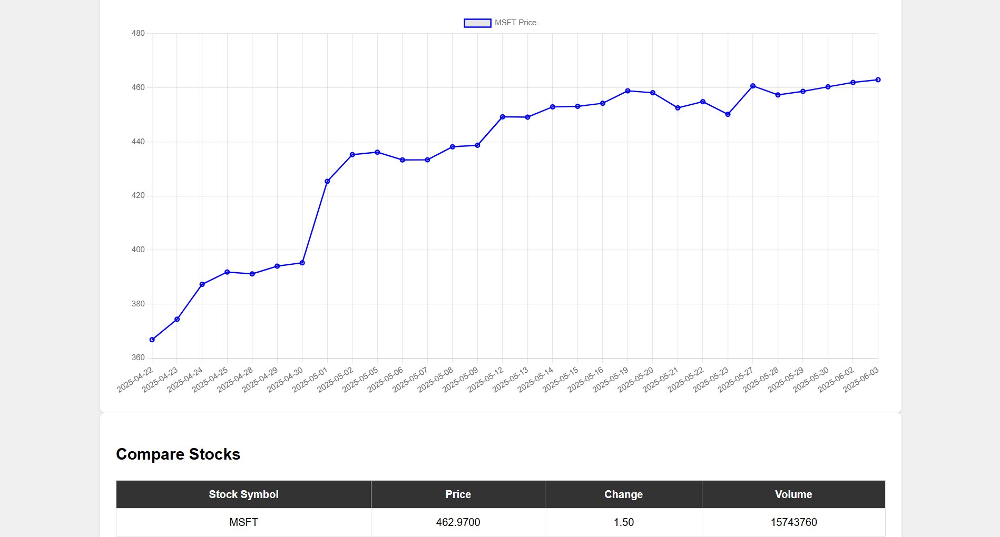

# 📈 Stock Tracker Dashboard

A sleek and interactive web application to monitor, analyze, and compare real-time stock market data. This dashboard utilizes the **Alpha Vantage API** to fetch live stock data and presents it using clean visuals, including dynamic charts and comparison tables.

  
---

## 🚀 Key Features

- 🔍 **Stock Symbol Search**: Instantly search for any stock using its ticker (e.g., AAPL, MSFT).
- 📊 **Stock Overview**: View the latest stock price, volume, open, high, and low values in a clean layout.
- 📈 **30-Day Price Trend Chart**: Visualize historical price movement using Chart.js.
- 🔥 **Trending Stocks Dropdown**: Quickly access and load data for popular or trending stocks.
- 📋 **Stock Comparison Table**: Compare multiple stocks side-by-side in a structured format.

---

## 🌐 Hosted Link

Try the app live here: [Live Demo Link](#)  
*_(Replace the `#` with your actual deployment link)_*

---

## 🛠️ Technologies Used

- **HTML5** – Page structure and layout  
- **CSS3** – Responsive design and visual styling  
- **JavaScript (ES6)** – Core logic and API handling  
- **Chart.js** – Charting library for price trends  
- **Alpha Vantage API** – Source of real-time stock market data

---